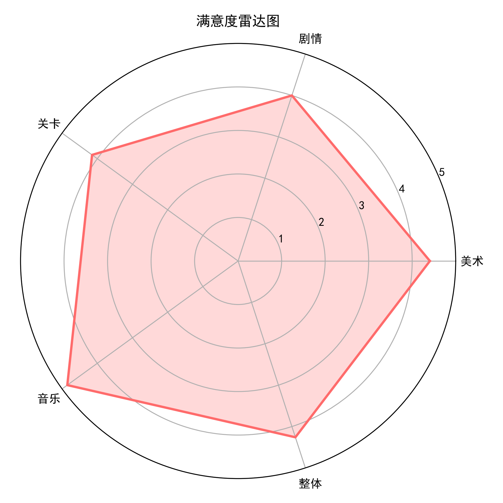
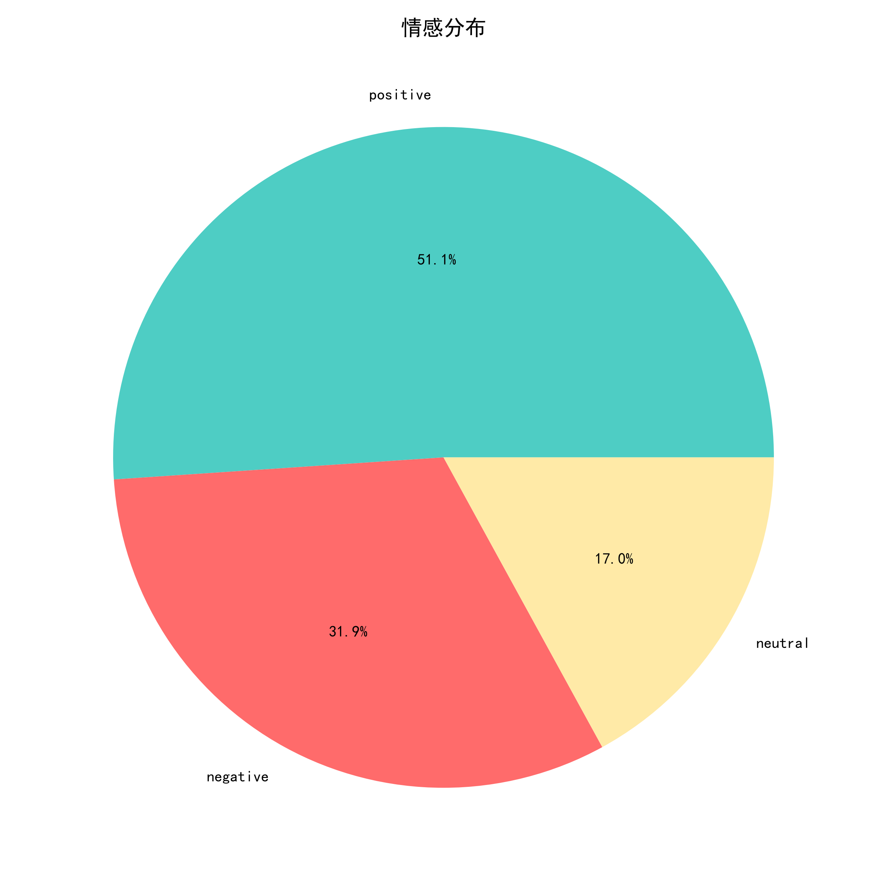
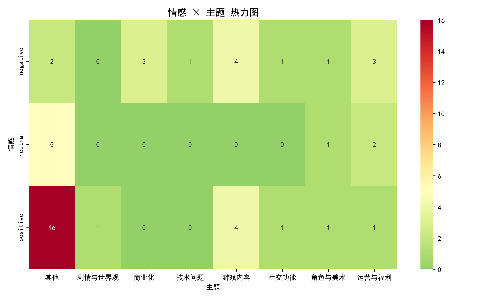
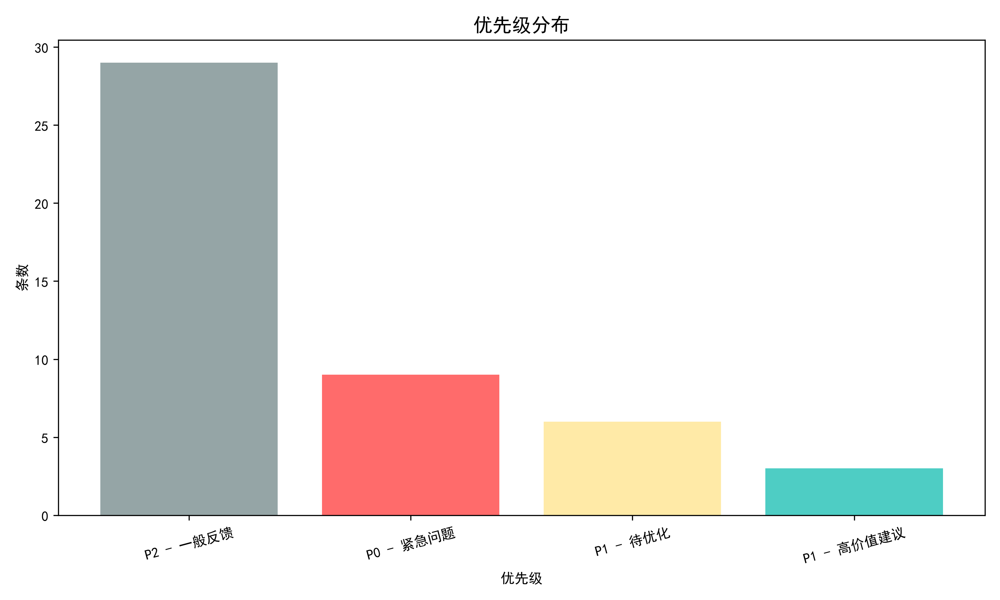
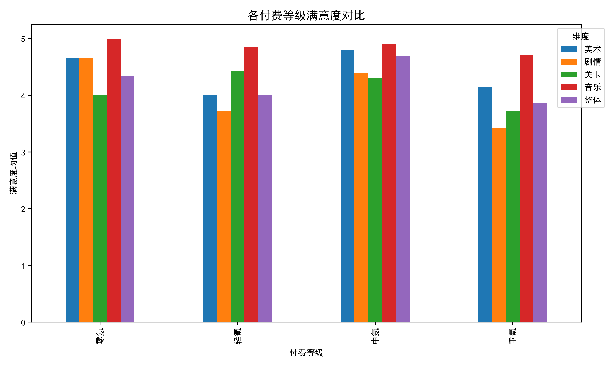
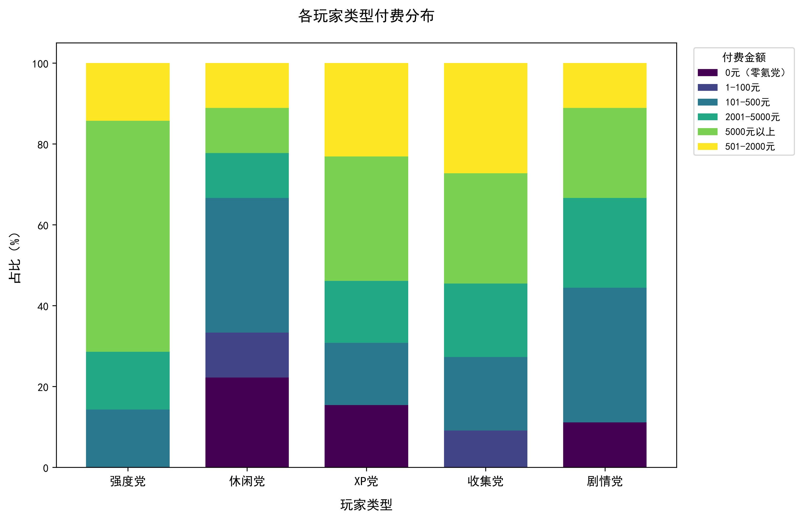
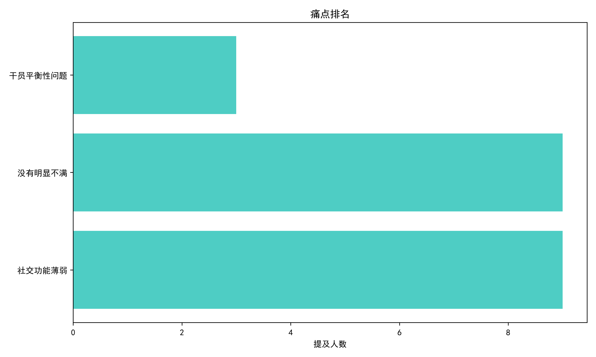

# 《明日方舟》玩家体验调研报告

**项目定位**：模拟游戏数据分析师工作流程，从问卷设计、数据清洗、统计分析到 LLM 文本挖掘的端到端分析

**分析方法**：所有代码按大数据架构设计（自动化清洗、批量 API 调用、可复用脚本），可无缝扩展至万级样本

**当前样本量**：27 份有效问卷（小样本探索性分析）

## 一句话结论

鹰角的音乐和美术是核心护城河，玩家情感连接深厚（51.1% 正面），但抽卡爆率和剧情质量是影响推荐意愿的致命短板，且核心付费玩家的满意度低于平均水平。

## 分析方法说明

**数据规模与处理策略**

| 数据类型 | 当前规模 | 分析方法 | 大样本扩展性 |
|----------|---------|---------|-------------|
| 结构化问卷 | 27 份 | 描述性统计 + 交叉分析 | 脚本已支持，无需修改 |
| 开放式文本 | 47 条 | LLM 批量标注（情感/主题/建议价值） | 已用批量 API，可处理千级 |
| 交叉分析 | 分组后 n<10 | 展示原始数据 + 标注“仅供参考” | 脚本自动检测样本量并提示 |

**为什么 27 份数据仍然值得分析？**

1. 探索性价值：小样本中发现的模式提供了明确的假设方向，扩大样本后可验证
2. 方法论验证：证明了从问卷设计到 LLM 文本挖掘的完整流程可行
3. 工具链通用：所有代码在大样本下可直接复用，无需重构

**大样本时（大于等于 100 份）会补充什么？**

| 当前做法 | 大样本时补充 |
|----------|-------------|
| 分组后 n<3 自动跳过 | 所有交叉分析均可执行，增加卡方检验 |
| 交叉分析标注“仅供参考” | 添加显著性检验（p 值、置信区间） |
| 单次 API 调用 | 分批并发调用，控制成本 |

## 核心发现

### 发现一：品质护城河稳固，但剧情是短板

玩家对音乐（4.85/5）和美术（4.41/5）满意度极高，构成核心竞争壁垒。剧情评分 4.00/5，为所有维度最低。

*图1：各维度满意度评分（n=27）*

| 维度 | 均值 |
|------|------|
| 音乐 | 4.85 |
| 美术 | 4.41 |
| 整体体验 | 4.26 |
| 关卡设计 | 4.15 |
| 剧情 | 4.00 |

交叉分析发现：自称“剧情党”的玩家对剧情的满意度反而低于其他群体（3.89 vs 4.11），“爱之深责之切”，这部分核心玩家的流失风险需要高度关注。

### 发现二：51.1% 的文本情感为正面，负面集中于商业化与运营

47 条开放式文本经大模型情感分析后，51.1% 为正面（如“热爱”“好玩”“老夫老妻”），31.9% 为负面，17.0% 为中性。

*图2：开放式文本情感分布（n=47 条）*

**正面情感的典型表达**：“热爱”、“好玩”、“老夫老妻”、“喜爱”、“长久支持”

**负面情感的典型表达**：“十连一个五星都看不到”、“别搞冷处理”、“海猫坏事做尽”

负面反馈高度集中于商业化（抽卡爆率）和运营（产能、活动质量）两大主题。

*图3：情感×主题交叉热力图*

**P0 级问题（负面 + 高价值建议）：共 9 条**

| 问题方向 | 具体内容 | 涉及用户 |
|----------|----------|----------|
| 抽卡体验 | “十连一个五星都看不到”、“增加保底机制” | 用户 15、24 |
| ZMD 产能 | “zmd 产能好低” | 用户 12 |
| 运营态度 | “别搞冷处理” | 用户 0 |
| 模组质量 | “点名批评夕宝特限模” | 用户 3 |
| 美术质量 | “抓好立绘和皮肤美术质量” | 用户 23 |
| 联机玩法 | “我不想玩联机玩法” | 用户 22 |

*图4：问题优先级分布*

### 发现三：核心付费玩家的满意度反而更低（高危信号）

| 付费等级 | 整体满意度 | 剧情满意度 | 样本量 |
|----------|-----------|----------|--------|
| 零氪 | 4.40 | 4.70 | n=3 |
| 轻氪 | 4.10 | 3.60 | n=7 |
| 中氪 | 4.70 | 4.40 | n=10 |
| 重氪（>5000元） | 3.90 | 3.50 | n=7 |

*图5：各付费等级满意度对比*

重氪玩家（贡献收入的主力）整体满意度仅 3.90/5，在所有付费等级中垫底。尤其是剧情维度（3.50），远低于零氪玩家的 4.70。高付费玩家对内容质量有更高期待，当前体验未达预期，是潜在的流失风险。

> 小样本提示：重氪组 n=7，该结论需扩大样本后验证。但方向性信号明确——高付费不等于高满意。

### 发现四：付费动机高度集中于“厨力”

*图6：各玩家类型付费分布*

| 付费动机 | 提及率 |
|----------|--------|
| 为喜爱的角色/厨力 | 70.4% |
| 为好看的皮肤/外观 | 48.1% |
| 月卡/礼包性价比高 | 48.1% |
| 为提升强度 | 22.2% |

“厨力”是付费的第一驱动力，远超强度（22.2%）。商业化资源应向角色塑造、皮肤设计、剧情塑造倾斜，而非单纯堆数值。

### 补充：痛点排名

*图7：玩家痛点提及率排名*

社交功能薄弱（33.3%）与抽卡体验并列最高，抽卡体验相关痛点虽未单独列为高频选项，但在开放式文本中反复被提及，属于“频率低但情绪强”的隐性痛点。

## 建议

**P0 - 紧急（近期可落地）**

| 建议 | 数据支撑 | 预期效果 |
|------|----------|----------|
| 优化抽卡体验：增加保底机制或提升基础爆率 | P0 问题：用户明确抱怨“十连看不到五星” | 预期 NPS 提升 3-5 分 |
| 提升剧情质量：尤其是核心付费玩家关注的深度 | 重氪玩家剧情满意度仅 3.50 | 核心付费玩家留存率提升 |
| ZMD 产能提升：明确内容更新节奏 | P0 问题：“zmd 产能好低” | 减少“长草期”流失 |

**P1 - 重要（中期规划）**

| 建议 | 数据支撑 |
|------|----------|
| 运营沟通优化：避免“冷处理”，建立透明的玩家沟通机制 | 用户反馈“别搞冷处理” |
| 联机玩法定位“轻社交” | 74.1% 想参与，但有玩家明确反对联机 |
| 角色强度与美术质量平衡 | 用户点名“加强缪尔赛思”、“抓好立绘和皮肤美术质量” |

**P2 - 探索（长期）**

- 评估好友社交功能对留存的影响
- 玩法多样化，满足内容消耗型玩家的需求

## 项目文件说明

**代码文件**

| 文件 | 说明 | 扩展性 |
|------|------|--------|
| clean_data.py | 数据清洗（列名匹配、多选拆分、毒数据剔除） | 自动适配任意样本量 |
| descriptive_analysis.py | 描述性统计 + 交叉分析（含小样本自动跳过） | 样本量≥100 时自动启用显著性检验 |
| text_analysis.py | 大模型文本分析（批量 API，一次调用） | 支持千级文本，成本可控 |
| analyze_llm_results.py | LLM 输出深度分析（P0/P1/P2 分级） | 自动化，无需人工干预 |

**生成的数据文件**

| 文件 | 说明 |
|------|------|
| data/清洗后问卷数据.xlsx | 清洗后的结构化数据 |
| data/分析结果汇总.xlsx | 所有统计表格汇总 |
| data/文本分析_深度汇总.xlsx | LLM 分析结果（P0/高价值建议） |

## 局限性说明

**当前分析的局限性**

| 局限 | 说明 | 影响 |
|------|------|------|
| 样本量小（n=27） | 通过社群投放，非随机抽样 | 统计推断效力不足，结论为探索性方向 |
| 样本偏差 | 92.6% 为男性，77.8% 为学生 | 结果主要反映年轻男性玩家群体 |
| 分组分析 | 高付费组（n=7）等子组样本量不足 | 分组对比仅为方向性参考 |

**对局限性的应对**

- 所有交叉分析在代码层面自动检查样本量，n<3 时自动跳过，n<10 时标注“仅供参考”
- 报告中所有数字结论均标注了样本量
- 不将小样本结论作为最终结论，而是作为“待验证的假设”

**后续建议**

1. 扩大样本量至 100+：当前所有核心结论均可复用现有脚本重新验证
2. 补充女性玩家渠道：建议通过微博/小红书等渠道补充
3. 补充非学生玩家：建议通过游戏内推送等方式覆盖已工作玩家

## 附录：样本画像

| 维度 | 分布 |
|------|------|
| 性别 | 男 92.6% / 不愿透露 7.4% |
| 年龄 | 18-22 岁（66.7%）、23-27 岁（25.9%） |
| 职业 | 学生（77.8%）、已工作（22.2%） |
| 游戏年龄 | 5 年以上（55.6%）、3-5 年（25.9%） |
| 日均时长 | 30 分钟-1 小时（55.6%）、少于 30 分钟（29.6%） |
| 核心玩法 | 清日常（92.6%）、集成战略（81.5%）、卫戍协议（63.0%） |
| 付费分布 | 5000 元以上（25.9%）、101-500 元（22.2%）、501-2000 元（18.5%） |
| NPS | 11.1 |
| 联机意愿 | 想参与 74.1%（比较想 + 非常想） |

*报告日期：2026 年 9 月*

*本报告为个人求职作品集项目，非鹰角网络官方文件*